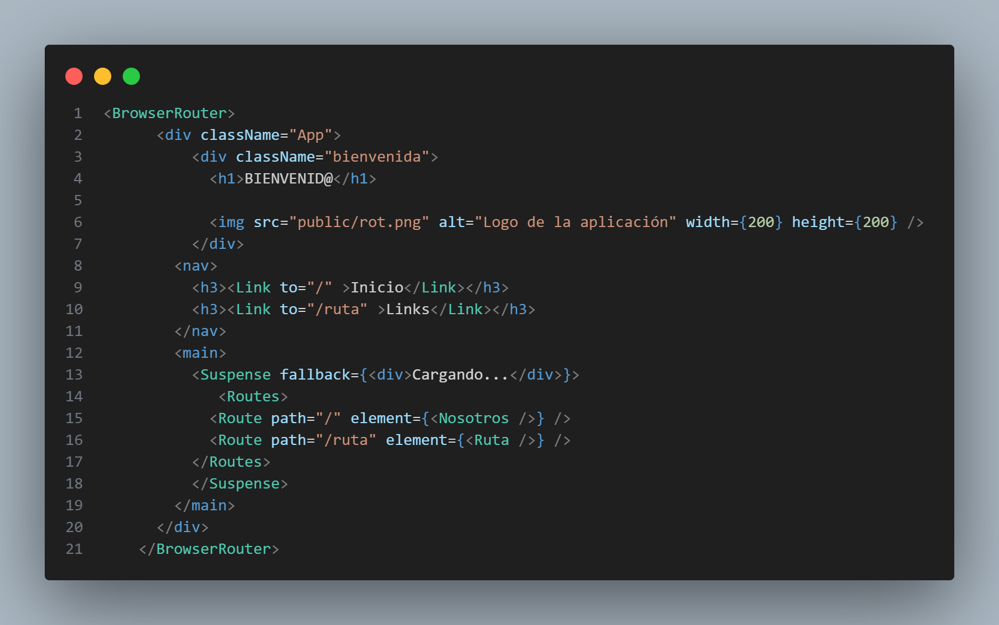

# Semana 6: RUTAS Y NAVEGACIÓN

## Integrantes del proyecto 

- Keyla Dayana Arboleda Mina 

- Carlos Andres Cifuentes Montaño

- Darío Restrepo Landázury

- Jose Fernando Sinisterra Ibargüen 

---

El **enrutamiento** es el proceso de definir cómo una aplicación web maneja diferentes URL's o rutas que el usuario puede visitar. En **React**, se utiliza la herramienta **React Router DOM** para la creación de una navegación fluida, mejorando tanto la experiencia del usuario como el rendimiento general de la aplicación web.

---
### Instalación

Para su instalación, se ejecuta el siguiente comando en la terminal:
> npm install react-router-dom

Además, se debe verificar que esté en la configuración del proyecto, en un archivo json. Puede ver la configuración y versión instalada tanto [aquí](package.json) como [aquí](package-lock.json).

---

### Creando Rutas

En este proyecto se ha implementado la creación de rutas, que se encuentra en el componente [App](src/App.jsx) del proyecto. La implementación de las rutas se da aquí:

En esta sección del código apreciamos que:
- Se empieza por la etiqueta **BrowserRouter** que se utiliza para habilitar el enrutamiento desde el lado del cliente. Asimismo, vemos la etiqueta **Link** que sirve para definir la relación entre documento actual y los demás componentes.  

- La etiqueta **Suspense** sirve para pausar la renderización hasta que se realice la carga de datos o código mostrando la interfaz alternativa. Y, **Fallback** se refiere a una interfaz de usuario alternativa que se muestra cuando se cumplen ciertas condiciones.

- El **Route** este establece una ruta específica y la asocia con un componente que coincida. Además, el **Routes** actua como contenedor para agrupar las rutas individuales. 