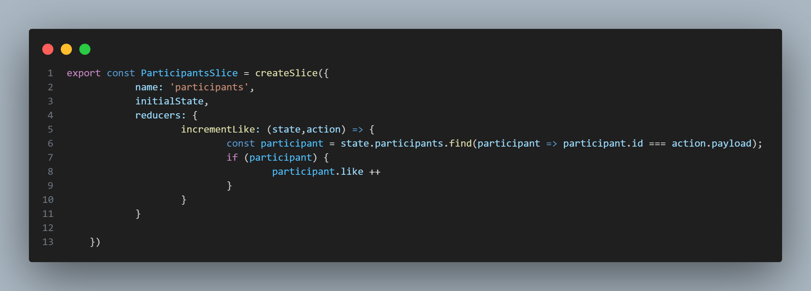

# Semana 5: ESTADO Y FLUJO DE DATOS


## Integrantes del proyecto 

- Keyla Dayana Arboleda Mina 

- Carlos Andres Cifuentes Montaño

- Darío Restrepo Landázury

- Jose Fernando Sinisterra Ibargüen 

---

En **React**, los componentes a menudo necesitan cambiar lo que se muestra en pantalla como resultado de una interacción. Para manejar el estado en react se utiliza el hook useState que permite agregar variables de estados a los componentes. 

## Estado Local vs Estado Global

### Estado Local con useState

El estado local se maneja usando el hook `useState` y es específico para cada componente. En nuestro proyecto, un ejemplo claro es el componente [`Avatar`](src/components/Avatar.jsx) que maneja un estado local para controlar si la descripción está expandida:


### Estado Global con Redux

Para manejar el estado global de la aplicación, utilizamos Redux a través de [@reduxjs/toolkit](https://redux-toolkit.js.org/). En nuestro proyecto, manejamos el estado de los participantes y sus "likes" de forma global.

Definición del slice en [`ParticipantsSlice.js`](src/store/ParticipantsSlice.js):



## Flujo de Datos

### Props Down, Events Up

El flujo de datos en React sigue un patrón unidireccional. En nuestro componente [`Landing`](src/components/Landing.jsx), pasamos datos hacia abajo a través de props:

```jsx
<Avatar
    person={{
        name: participant.role,
        imageUrl: participant.imageUrl,
        description: participant.description
    }}
    size={100}
/>
```

### Gestión de Estado con Redux

Para acceder y modificar el estado global, usamos los hooks `useSelector` y `useDispatch`:

```jsx
// Acceder al estado (useSelector)
const participants = useSelector(state => state.participants.participants);

// Modificar el estado (useDispatch)
const dispatch = useDispatch();
dispatch(incrementLike(participantId));
```

## Ejemplo Práctico: Sistema de Likes

En nuestro [`Button`](src/components/Button.jsx) component, implementamos un sistema de likes que:
1. Lee el estado actual desde Redux
2. Permite incrementar likes hasta un límite de 10
3. Cambia el estilo del botón según la cantidad de likes

```jsx
export default function Button({ participantId, children, disabled = false }) {
    const dispatch = useDispatch();
    const participant = useSelector(state => 
        state.participants.participants.find(p => p.id === participantId)
    );
    const count = participant?.like || 0;

    function like() {
        if (count < 10) {
            dispatch(incrementLike(participantId));
        }
    }
    // ...
}
```

## Configuración del Store

El store de Redux se configura en [`store.js`](src/store/store.js) y se provee a toda la aplicación en [`main.jsx`](src/main.jsx):

```jsx
// Configuración del store
const store = configureStore({
    reducer: {
        participants: ParticipantsReducer
    }    
});

// Provisión del store
<Provider store={store}>
    <Landing/>  
</Provider>
```

> Implementar estados permite mantener la lógica de los componentes separada y organizada para su reutilización para cuando se requiera.