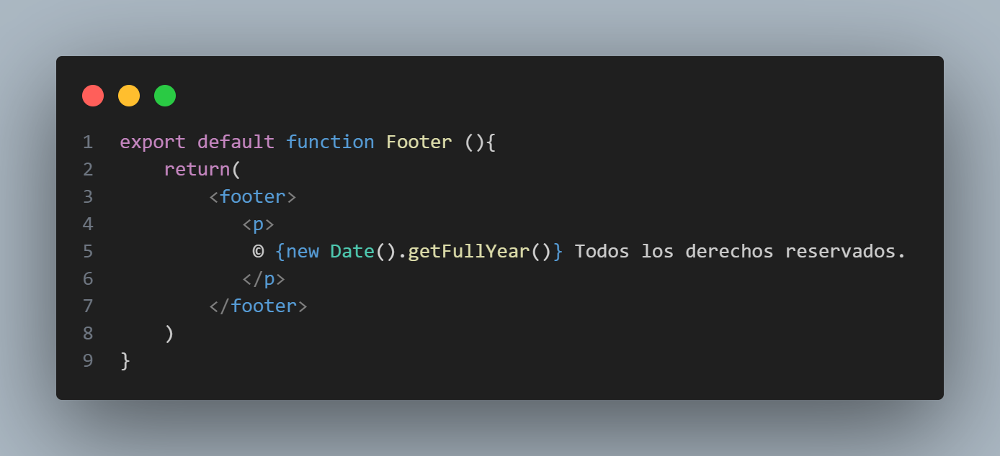
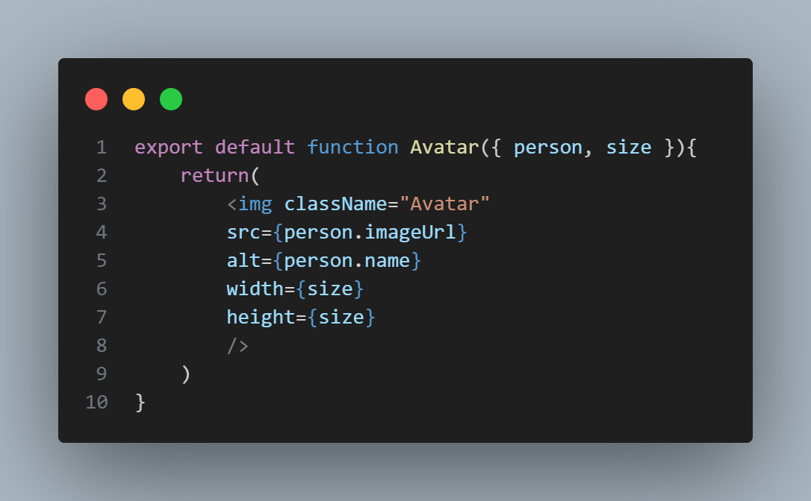

# Semana 4: COMPONENTES Y CICLO DE VIDA

## Integrantes del proyecto 

- Keyla Dayana Arboleda Mina 

- Carlos Andres Cifuentes Montaño

- Darío Restrepo Landázury

- Jose Fernando Sinisterra Ibargüen 

---

### COMPONENTES 

Son **piezas de código que renderizan una parte de la interfaz**. Los componentes pueden ser parametrizados, reutilizados y pueden contener su propio estado. Se crean usando funciones o clases.

> Tenga en cuenta que los componentes de React son funciones regulares de JavaScript, pero sus nombres deben comenzar con letra mayúscula o no funcionarán.

> El siguiente componente muestra la construcción de un footer:

### PROPS

Son una forma de pasar **datos de un componente padre a un componente hijo**. Se ven y funcionan como un **parámetros de una función**, permitiendo que un componente reciba reciba información externa y la utilice para renderizar contenido dinámico.

Los props poseen de manera destacable las siguientes características:
- Son inmutables, es decir que no se puede modificar dentro del componente que lo recibe.
- Son Unidireccionales y los datos fluyen de arriba a abajo(padre a hijo).
- Son personalizables y permiten reutilizar componentes con diferentes datos.

> En el siguiente ejemplo, podemos ver los props de un componente:

---

### INTEGRACIÓN DE COMPONENTES

Del proyecto, en el componente [Landing](src/components/Landing.jsx) combinamos los 2 componentes mostrados anteriormente, mas otros. Se integran:
- El componente `Avatar` para mostrar las imágenes de los integrantes.
- El componente `Footer` para mostrar el pie de página.
- El componente `Button` para interacciones.