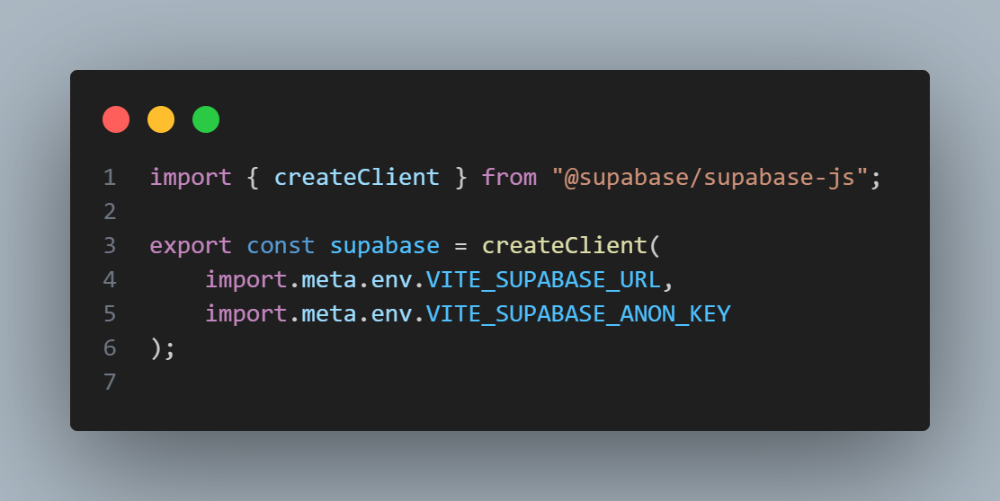

# **SEMANA 10 (SPRINT 1): AUTENTICACIÓN**

## Integrantes del proyecto

- Keyla Dayana Arboleda Mina
- Carlos Andres Cifuentes Montaño
- Darío Restrepo Landázury
- Jose Fernando Sinisterra Ibargüen

---

### ¿QUÉ ES LA AUTENTICACIÓN?

Es un proceso utilizado para **verificar/confirmar** que solo se use la web por **personas registradas en esta**. Su importancia radica en la **protección de datos y el mantenimiento de la confidencialidad de la información sensible**.
> Un concepto que relacionado a la autnticación es la **autorización**, la cual define el alcance de lo que puede hacer cada usuario en el sistema. El alcance se clasifica por roles.

## **IMPLEMENTACIÓN**

### **¿Qué hemos elegido para realizar la autenticación?**

Para este caso, se optó por **Supabase**, el cual es un **BaaS** (*Backend as a Service*) que entre sus opciones, está la autenticación que a su vez tiene distintos métodos (SSO, Magic Link, OAuth, etc).

### **Método de Autenticación Utilizado**

Se implementó la autenticación mediante **Email y Contraseña** (*Email/Password Authentication*), que es uno de los métodos más tradicionales y ampliamente utilizados. Este método permite:

- Registro de nuevos usuarios con email y contraseña.
- Inicio de sesión con credenciales.
- Gestión automática de sesiones.
- Seguridad en el almacenamiento de contraseñas.

### **¿Donde se orgnizó la configuración del Auth?**

La implementación se organizó en los siguientes archivos dentro de `src/Supabase/`:

#### **1. `Conection.js`**

El siguiente bloque de código muestra la configuración que establece la conexión con Supabase utilizando las credenciales del proyecto:

#### **2. `RegistroSupabase.jsx`**

Este [componente](#2-registrosupabasejsx) se encarga de manejar el registro de nuestros usuarios. Para ello, implementa:

- Un formulario de registro con validación.
- Llamada al método `supabase.auth.signUp()` para registrar al usuario.
- Manejo de errores y respuestas.
- Confirmación de éxito en el registro.

> También se envía un correo de verificación a la dirección registrada con el fin de que este valide su registro para poder iniciar sesión.

#### **3. `LoginSupabase.jsx`**

En [Este componente](#loginsupabasejsx), se maneja el inicio de sesión (*login*), donde se implementa:

- Formulario de login.
- Validación de las credenciales del usuario
- Llama al método `supabase.auth.signInWithPassword()` para *loguear* al usuario.
- Gestión de estados de sesión.
- Manejo de errores.

---
Gracias a todo lo anterior, es posible implementar la autentiación de usuarios en este proyecto.
