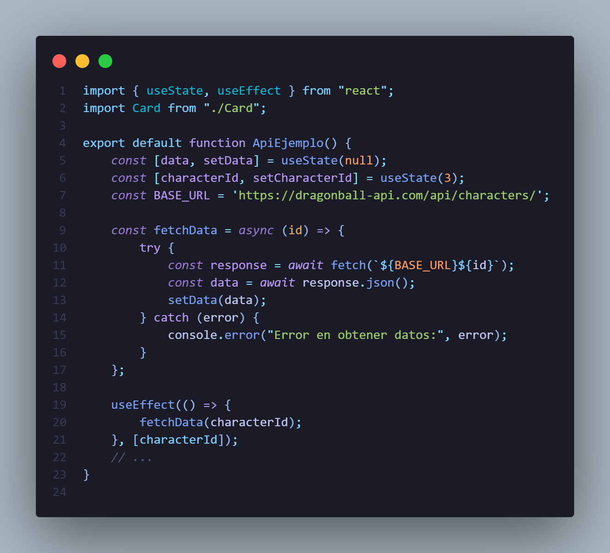

# Semana 7: CONSUMO DE API'S Y MANEJO DE ERRORES

## Integrantes del proyecto

- Keyla Dayana Arboleda Mina
- Carlos Andres Cifuentes Montaño
- Darío Restrepo Landázury
- Jose Fernando Sinisterra Ibargüen

---

Para empezar, una **API** (Application Programming Interface) nos permite la comunicación entre 2 o más elementos o sistemas.

---

## Consumo de API en este proyecto React

### ¿Dónde se realiza el consumo de API?

El consumo de API se implementa en el componente [`ApiEjemplo`](src/components/ApiEjemplo.jsx), ubicado en [src/components/ApiEjemplo.jsx](src/components/ApiEjemplo.jsx).

### Descripción del componente

- El componente utiliza la API pública de Dragon Ball:  
  `https://dragonball-api.com/api/characters/`
- Permite navegar entre personajes usando botones "Anterior" y "Siguiente".
- Muestra la información del personaje seleccionado en una tarjeta (`Card`).

### Lógica de consumo

- Se utiliza el hook `useEffect` para realizar la petición cada vez que cambia el ID del personaje.
- El hook `useState` gestiona el estado del personaje actual y los datos obtenidos.
- El método `fetch` realiza la petición HTTP GET a la API.
- Se maneja el estado de carga y posibles errores en consola.

### Ejemplo de código 

